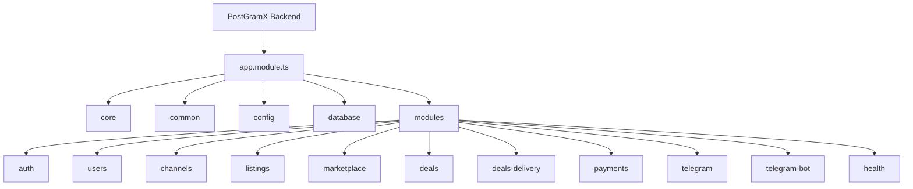

# Architecture

## Overview

PostGramX backend is a modular NestJS service that powers a Telegram ads marketplace. It exposes APIs for the Mini App and bot and manages deals escrow and posting automation.

## Main modules

- Auth and Users for identity and access
- Channels for verification and stats
- Listings and Marketplace for inventory and discovery
- Deals for negotiation creative scheduling and state
- Deals Delivery for auto posting and verification
- Payments for escrow wallets deposits payouts and refunds
- Telegram and Telegram Bot for messages and workflow actions

## Core entities

- Deal is the main aggregate
- Deal Creative tracks assets and approvals
- Deal Escrow tracks deposit address status and settlement
- Deal Publication tracks posting status and verification

## Module architecture diagram



## Project layout

```text
src/
  app.module.ts
  common/
  config/
  core/
  database/
  modules/
    auth/
    users/
    channels/
    listings/
    marketplace/
    deals/
    deals-delivery/
    payments/
    telegram/
    telegram-bot/
    health/
```

## Deal state machine

Deal stages live in a strict state machine. The stage drives the public deal status and controls what actions are allowed. The state machine allows forward progress and controlled cancellations.

## Escrow design

Each deal can create a dedicated TON deposit wallet. Deposits are confirmed by a watcher and update escrow status. Settlement runs separately and releases payout or refund after delivery verification.

## Async processing

- Deal timeouts cancel idle negotiations and expired payments
- Posting worker publishes content and verifies delivery
- Payout processor handles payouts and refunds with idempotency

## Why this structure

- Modular NestJS keeps each domain clear and testable
- Deal centric design keeps product flow aligned with payments and delivery
- Escrow and settlement are isolated from UI and messaging
- Async jobs prevent blocking user requests
