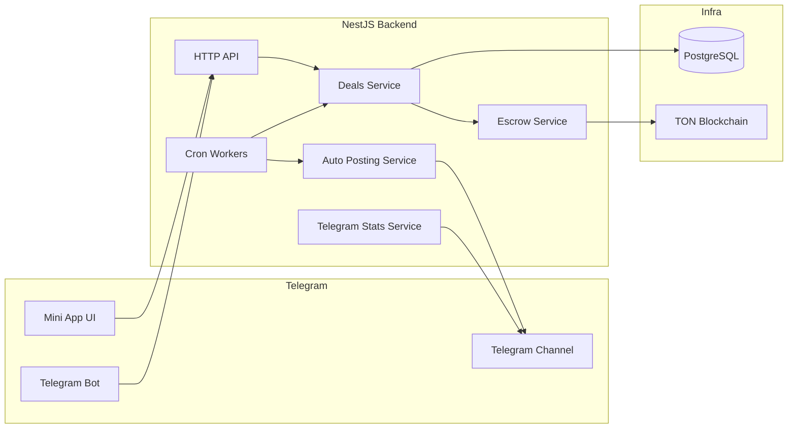

# Architecture

## High level view

PostGramX backend follows modular NestJS design.
Each module owns one domain area and exposes services and controllers.

Main modules:

- `auth`
- `users`
- `channels`
- `deals`
- `deals-delivery`
- `payments`
- `telegram`
- `telegram-bot`
- `telegram-mtproto`
- `post-analytics`

## Component diagram

Mermaid source: `docs/diagrams/system-architecture.mmd`

## Why NestJS

- Clear module boundaries
- Built in dependency injection
- Predictable controller and service split
- Good fit for background jobs cron and integrations

## Domain model focus

Deal is the center of the product flow.
Other entities attach to the deal and track each phase.

- `DealEntity` stores business status stage deadlines and actors
- `DealCreativeEntity` stores creative review status
- `DealEscrowEntity` stores funding payout and refund status
- `DealPublicationEntity` stores publication and verification status

This model keeps state explicit and audit friendly.

## State machine approach

Deal stage and status are mapped with deterministic rules.
`DealStage` is used for product flow.
`DealStatus` is used for grouped UX states like pending active completed or canceled.

Mapping logic is centralized in state mapper.

## Async operations

The backend uses scheduled jobs for critical async actions.

- Timeout cancellation for idle deals
- Payment deadline expiration handling
- Post verification monitoring
- Pinned visibility tracking

This keeps external API operations resilient and retriable.

## Integrations

- Telegram bot commands for user actions and notifications
- Telegram MTProto services for channel and post checks
- TON payment processing for escrow and payout flow
- PostgreSQL persistence through TypeORM entities

## Design goals

- Clear ownership per module
- Strong deal integrity
- Idempotent payment transitions
- Safe retry paths for async workers
- Easy extension for future mini app features
