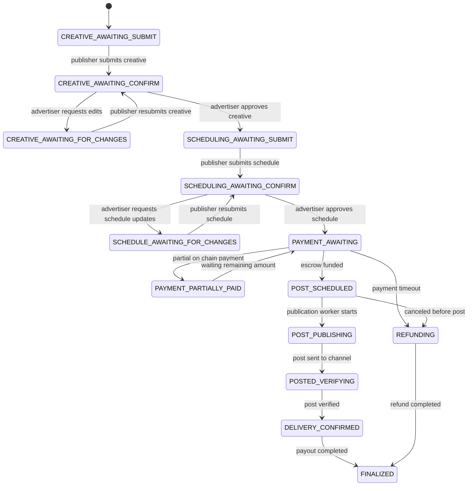
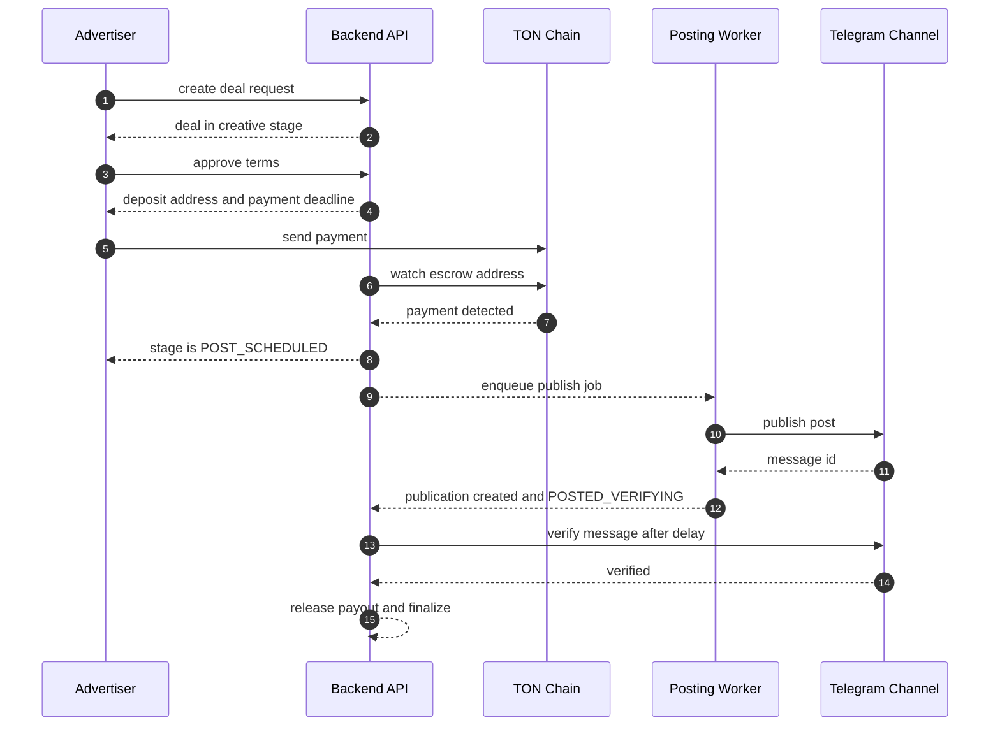

# Deal Flow

Mermaid source: `docs/diagrams/deal-lifecycle.mmd`

## Escrow and auto posting sequence

Mermaid source: `docs/diagrams/deal-sequence.mmd`

## Lifecycle overview

Happy path:

`CREATIVE_AWAITING_SUBMIT`
→ `CREATIVE_AWAITING_CONFIRM`
→ `SCHEDULING_AWAITING_SUBMIT`
→ `SCHEDULING_AWAITING_CONFIRM`
→ `PAYMENT_AWAITING`
→ `POST_SCHEDULED`
→ `POST_PUBLISHING`
→ `POSTED_VERIFYING`
→ `DELIVERY_CONFIRMED`
→ `FINALIZED`

Change request loops:

- Creative feedback can move flow to `CREATIVE_AWAITING_FOR_CHANGES`
- Schedule feedback can move flow to `SCHEDULE_AWAITING_FOR_CHANGES`

Payment partial flow:

`PAYMENT_AWAITING` → `PAYMENT_PARTIALLY_PAID` → `PAYMENT_AWAITING`

Cancel and refund flow:

`PAYMENT_AWAITING` or review stages
→ `REFUNDING`
→ `FINALIZED`

## Who can trigger transitions

- Advertiser confirms creative and scheduling decisions
- Publisher submits creative and scheduling proposals
- System jobs process timeout cancel payment expiry and verification updates
- Payment services set escrow related transitions after blockchain checks

## Timeouts and auto cancel

Timeout worker scans deals with expired idle deadlines in review or scheduling stages.
Expired deals are canceled with timeout reason.

Payment timeout worker scans escrows with `AWAITING_PAYMENT` or `PAID_PARTIAL` and expired payment deadline.
Deal is canceled and partial funds can enter refund flow.

## Status groups

`DealStatus` groups map from stage values:

- `PENDING`
- `ACTIVE`
- `COMPLETED`
- `CANCELED`

This grouping is used for API list responses and UX sections.

## Related entity statuses

Creative status:

- `DRAFT`
- `RECEIVED_IN_BOT`
- `REJECTED`
- `APPROVED`

Escrow status:

- `CREATED`
- `AWAITING_PAYMENT`
- `PAID_PARTIAL`
- `PAID_HELD`
- `REFUND_PENDING`
- `REFUNDED`
- `PAYOUT_PENDING`
- `PAID_OUT`
- `FAILED`

Publication status:

- `NOT_POSTED`
- `POSTED`
- `VERIFIED`
- `FAILED`
- `DELETED_OR_EDITED`
