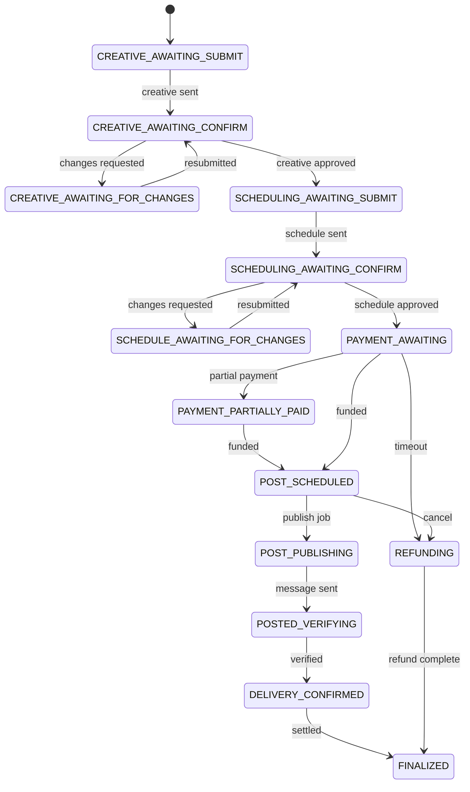
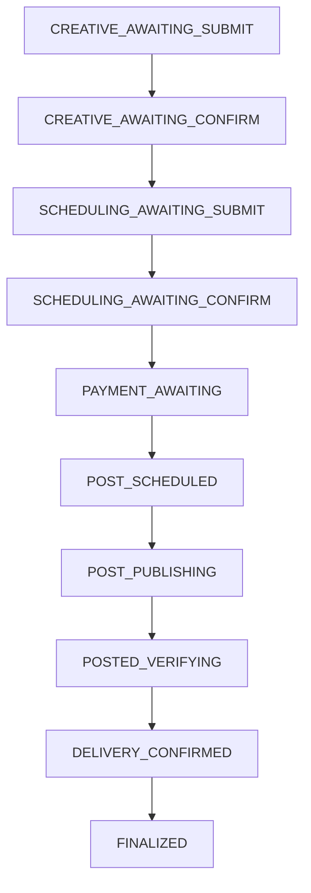
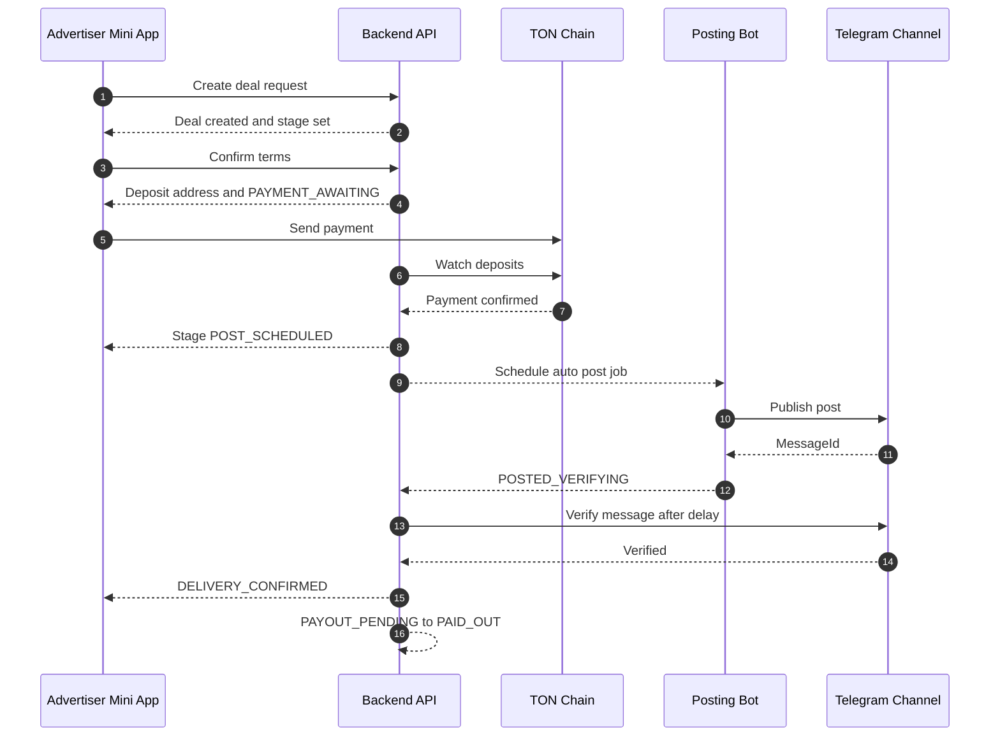

# Deal Flow

## Deal lifecycle diagram

## High level flow

## Deal stages

- CREATIVE_AWAITING_SUBMIT
- CREATIVE_AWAITING_CONFIRM
- CREATIVE_AWAITING_FOR_CHANGES
- SCHEDULING_AWAITING_SUBMIT
- SCHEDULING_AWAITING_CONFIRM
- SCHEDULE_AWAITING_FOR_CHANGES
- PAYMENT_AWAITING
- PAYMENT_PARTIALLY_PAID
- POST_SCHEDULED
- POST_PUBLISHING
- POSTED_VERIFYING
- DELIVERY_CONFIRMED
- REFUNDING
- FINALIZED

## Allowed stage transitions

- CREATIVE_AWAITING_SUBMIT to CREATIVE_AWAITING_CONFIRM
- CREATIVE_AWAITING_SUBMIT to CREATIVE_AWAITING_FOR_CHANGES
- CREATIVE_AWAITING_SUBMIT to FINALIZED

- CREATIVE_AWAITING_FOR_CHANGES to CREATIVE_AWAITING_CONFIRM
- CREATIVE_AWAITING_FOR_CHANGES to CREATIVE_AWAITING_FOR_CHANGES
- CREATIVE_AWAITING_FOR_CHANGES to SCHEDULING_AWAITING_SUBMIT
- CREATIVE_AWAITING_FOR_CHANGES to FINALIZED

- CREATIVE_AWAITING_CONFIRM to SCHEDULING_AWAITING_SUBMIT
- CREATIVE_AWAITING_CONFIRM to CREATIVE_AWAITING_FOR_CHANGES
- CREATIVE_AWAITING_CONFIRM to FINALIZED

- SCHEDULING_AWAITING_SUBMIT to SCHEDULING_AWAITING_CONFIRM
- SCHEDULING_AWAITING_SUBMIT to SCHEDULE_AWAITING_FOR_CHANGES
- SCHEDULING_AWAITING_SUBMIT to FINALIZED

- SCHEDULING_AWAITING_CONFIRM to PAYMENT_AWAITING
- SCHEDULING_AWAITING_CONFIRM to FINALIZED

- SCHEDULE_AWAITING_FOR_CHANGES to SCHEDULE_AWAITING_FOR_CHANGES
- SCHEDULE_AWAITING_FOR_CHANGES to PAYMENT_AWAITING
- SCHEDULE_AWAITING_FOR_CHANGES to FINALIZED

- PAYMENT_AWAITING to PAYMENT_PARTIALLY_PAID
- PAYMENT_AWAITING to POST_SCHEDULED
- PAYMENT_AWAITING to REFUNDING
- PAYMENT_AWAITING to FINALIZED

- PAYMENT_PARTIALLY_PAID to POST_SCHEDULED
- PAYMENT_PARTIALLY_PAID to REFUNDING
- PAYMENT_PARTIALLY_PAID to FINALIZED

- POST_SCHEDULED to POST_PUBLISHING
- POST_SCHEDULED to REFUNDING
- POST_SCHEDULED to FINALIZED

- POST_PUBLISHING to POSTED_VERIFYING
- POST_PUBLISHING to REFUNDING
- POST_PUBLISHING to FINALIZED

- POSTED_VERIFYING to DELIVERY_CONFIRMED
- POSTED_VERIFYING to REFUNDING
- POSTED_VERIFYING to FINALIZED

- DELIVERY_CONFIRMED to FINALIZED
- REFUNDING to FINALIZED

## Creative status

- DRAFT
- RECEIVED_IN_BOT
- REJECTED
- APPROVED

## Escrow status

- CREATED
- AWAITING_PAYMENT
- PAID_PARTIAL
- PAID_HELD
- REFUND_PENDING
- REFUNDED
- PAYOUT_PENDING
- PAID_OUT
- FAILED

## Escrow status purpose

- CREATED means escrow is initialized and wallet can be created
- AWAITING_PAYMENT means deposit address exists and funding is expected
- PAID_PARTIAL means payment was detected but full amount is not yet funded
- PAID_HELD means funds are confirmed and held for delivery
- REFUND_PENDING means refund request is queued and awaiting payout processor
- REFUNDED means funds are returned to the advertiser
- PAYOUT_PENDING means payout request is queued and awaiting payout processor
- PAID_OUT means publisher has received the payout
- FAILED means payment window expired or escrow processing failed

## Publication status

- NOT_POSTED
- POSTED
- VERIFIED
- FAILED
- DELETED_OR_EDITED

## Who triggers changes

- Advertiser can submit creative and approve changes
- Publisher can accept schedule and confirm posting details
- System updates payment status posting status and verification

## Timeouts and auto cancel

- Idle deals in creative or scheduling stages are canceled after idle timeout
- Escrows in awaiting or partial payment are canceled after payment deadline
- Partial payments are refunded when payment times out

## Escrow sequence diagram

