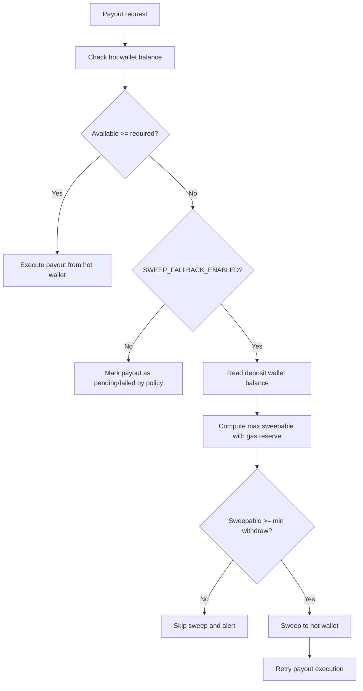
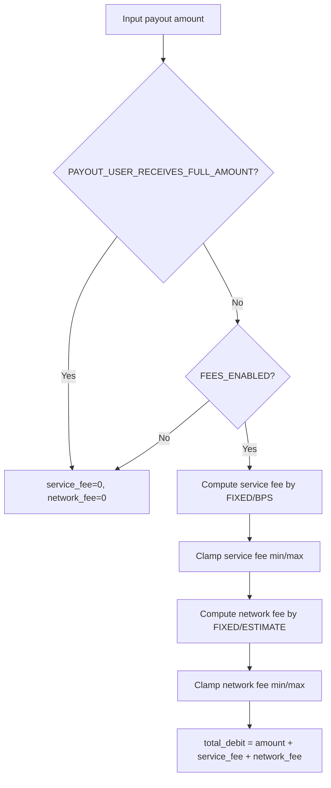

# Liquidity and Fees

This document explains how payout liquidity and commissions work in PostGramX backend.

## Scope

- Hot wallet liquidity checks before payout execution
- Fallback sweep logic from deal deposit wallets
- Payout fee calculation (service fee + network fee)
- Key environment variables for safe rollout

## 1) Liquidity flow

The payout processor works with hot wallet balance first.
If hot wallet has enough available balance (with reserve), payout can be sent directly.
If not enough and fallback is enabled, the system can sweep funds from a deal deposit wallet and retry.

Source diagram: [docs/diagrams/liquidity-flow.mmd](./docs/diagrams/liquidity-flow.mmd)

### Liquidity formulas

- `available_hot = hot_balance - HOT_WALLET_MIN_RESERVE_NANO`
- `can_spend = available_hot >= required_amount`
- `max_sweepable = max(0, deposit_balance - SWEEP_MAX_GAS_RESERVE_NANO)`
- Sweep can proceed only when `max_sweepable >= SWEEP_MIN_WITHDRAW_NANO`

## 2) Fee model for payouts

Payout debit is calculated as:

- `total_debit = payout_amount + service_fee + network_fee`

### Service fee

- `PAYOUT_SERVICE_FEE_MODE=FIXED`: use `PAYOUT_SERVICE_FEE_FIXED_NANO`
- `PAYOUT_SERVICE_FEE_MODE=BPS`: `ceil(amount * bps / 10000)` using `PAYOUT_SERVICE_FEE_BPS`
- Apply min/max clamps if configured:
  - `PAYOUT_SERVICE_FEE_MIN_NANO`
  - `PAYOUT_SERVICE_FEE_MAX_NANO` (optional)

### Network fee

- `PAYOUT_NETWORK_FEE_MODE=FIXED`: use `PAYOUT_NETWORK_FEE_FIXED_NANO`
- `PAYOUT_NETWORK_FEE_MODE=ESTIMATE`: estimate transfer fee (if estimator and destination available), otherwise fallback to fixed fee
- Apply min/max clamps:
  - `PAYOUT_NETWORK_FEE_MIN_NANO`
  - `PAYOUT_NETWORK_FEE_MAX_NANO` (optional)

### Feature toggles

- `PAYOUT_USER_RECEIVES_FULL_AMOUNT=true` → force zero fees, debit equals payout amount
- `FEES_ENABLED=false` → force zero fees
- `PAYOUT_MIN_NET_AMOUNT_NANO` (optional) → minimum allowed payout amount validation

Source diagram: [docs/diagrams/fees-calculation-flow.mmd](./docs/diagrams/fees-calculation-flow.mmd)

## 3) Key env configuration

### Liquidity / hot wallet

- `HOT_WALLET_ENABLED`
- `HOT_WALLET_ADDRESS`
- `HOT_WALLET_MNEMONIC`
- `HOT_WALLET_MIN_RESERVE_NANO`
- `HOT_WALLET_LOW_LIQUIDITY_THRESHOLD_NANO`
- `SWEEP_FALLBACK_ENABLED`
- `SWEEP_MAX_GAS_RESERVE_NANO`
- `SWEEP_MIN_WITHDRAW_NANO`
- `SWEEP_ONLY_FOR_THIS_DEAL`
- `SWEEP_MAX_RETRIES`
- `WALLET_MASTER_KEY` (required when sweep fallback is enabled)

### TON connectivity

- `TONCENTER_RPC` (required)
- `TONCENTER_API_KEY` (optional but recommended)

### Fees

- `FEES_ENABLED`
- `PAYOUT_USER_RECEIVES_FULL_AMOUNT`
- `PAYOUT_SERVICE_FEE_MODE`
- `PAYOUT_SERVICE_FEE_FIXED_NANO`
- `PAYOUT_SERVICE_FEE_BPS`
- `PAYOUT_SERVICE_FEE_MIN_NANO`
- `PAYOUT_SERVICE_FEE_MAX_NANO`
- `PAYOUT_NETWORK_FEE_MODE`
- `PAYOUT_NETWORK_FEE_FIXED_NANO`
- `PAYOUT_NETWORK_FEE_MIN_NANO`
- `PAYOUT_NETWORK_FEE_MAX_NANO`
- `PAYOUT_MIN_NET_AMOUNT_NANO`
- `FEE_REVENUE_STRATEGY`
- `FEE_REVENUE_ADDRESS`

## 4) Production safety recommendations

- Keep non-zero `HOT_WALLET_MIN_RESERVE_NANO` to prevent full drain.
- Start with conservative `PAYOUT_BATCH_LIMIT` and observe TON fees/latency.
- Enable admin alerts for low liquidity and payout failures.
- Roll out `ESTIMATE` network fee mode only after monitoring estimator stability.
- Use separate wallets/keys per environment (`local`, `stage`, `production`).
