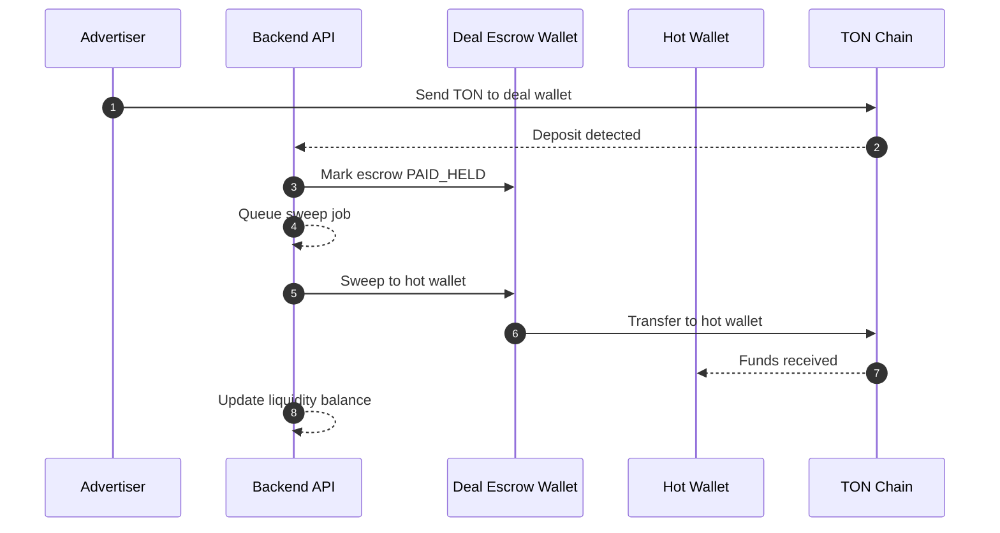
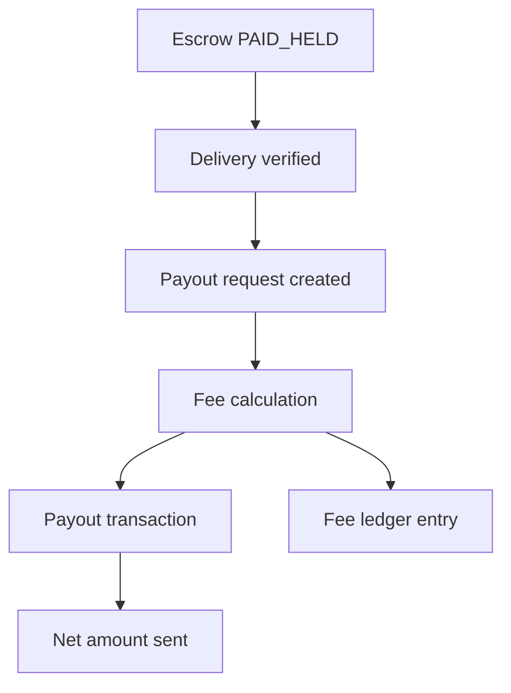

# Liquidity and Fees

## Overview

This document describes how liquidity is managed and how fees are applied in the TON escrow pipeline. The goal is to keep payouts safe predictable and auditable.

## Liquidity model

- Escrow wallets are created per deal
- Deposits are confirmed by the watcher
- Hot wallet provides settlement liquidity
- Sweep jobs move funds from deal wallets to the hot wallet

## Fee model

- Fees are applied at payout time
- Fee calculations use total debit amounts and transfer costs
- Fee records are stored with payout transactions

## Liquidity flow diagram

## Fee application diagram

## Status checkpoints

- Escrow PAID_HELD means funds are secured and can be settled
- Escrow PAYOUT_PENDING means payout is queued and awaiting processing
- Escrow PAID_OUT means payout completed and fees locked
- Escrow REFUND_PENDING means refund queued and fees are not applied

## Operational notes

- Liquidity alerts are raised when hot wallet balance is low
- Sweep and payout jobs use idempotency keys
- Failed transfers are retried and marked with terminal status when needed
