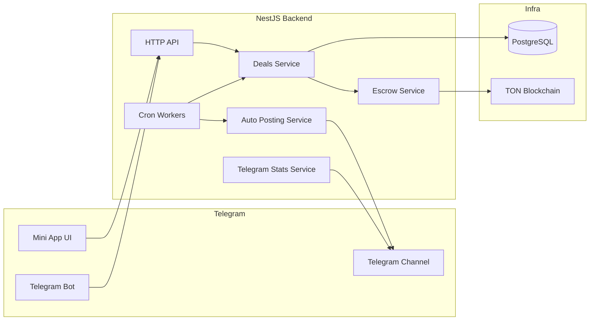

# PostGramX Backend

Open source backend for a Telegram ads marketplace MVP with escrow on TON.


## What this project shows

- Product first two sided marketplace logic
- Escrow first payment model on TON
- Deal lifecycle based on explicit states
- Async posting verification and payout release
- Backend architecture ready for production growth

## Architecture preview



Source file: `docs/diagrams/system-architecture.mmd`

## Core concept

The platform is built around one Deal entity.
A deal links advertiser publisher channel creative escrow and publication.
This keeps business logic in one flow and avoids split state.

Main entities:

- `DealEntity`
- `DealCreativeEntity`
- `DealEscrowEntity`
- `DealPublicationEntity`

## Deal lifecycle

Main stage flow:

`CREATIVE_AWAITING_SUBMIT`
→ `CREATIVE_AWAITING_CONFIRM`
→ `SCHEDULING_AWAITING_SUBMIT`
→ `SCHEDULING_AWAITING_CONFIRM`
→ `PAYMENT_AWAITING`
→ `PAYMENT_PARTIALLY_PAID`
→ `POST_SCHEDULED`
→ `POST_PUBLISHING`
→ `POSTED_VERIFYING`
→ `DELIVERY_CONFIRMED`
→ `FINALIZED`

Cancel and refund path:

`REFUNDING` → `FINALIZED`

See full rules and diagrams in [DEAL_FLOW.md](./DEAL_FLOW.md).

## Escrow model

- Advertiser sends funds to escrow deposit address
- Funds are held before posting is verified
- Payout is released only after delivery confirmation
- Refund path is handled by state aware jobs and payment services

See details in [SECURITY.md](./SECURITY.md).

## Telegram analytics and verification

- Channel and posting data are validated through Telegram services
- Post monitoring runs in background workers
- Publication can be marked as edited deleted failed or verified
- Delivery checks drive settlement and payout eligibility

## Documentation map

- [ARCHITECTURE.md](./ARCHITECTURE.md)
- [DEAL_FLOW.md](./DEAL_FLOW.md)
- [SECURITY.md](./SECURITY.md)
- [ROADMAP.md](./ROADMAP.md)
- [docs/diagrams/system-architecture.mmd](./docs/diagrams/system-architecture.mmd)
- [docs/diagrams/deal-lifecycle.mmd](./docs/diagrams/deal-lifecycle.mmd)
- [docs/diagrams/deal-sequence.mmd](./docs/diagrams/deal-sequence.mmd)
- [docs/diagrams/escrow-status-flow.mmd](./docs/diagrams/escrow-status-flow.mmd)

## Tech stack

Backend:

- NestJS
- TypeScript
- TypeORM
- PostgreSQL
- TON libraries (`@ton/ton`)
- Telegram bot and MTProto integrations

## Run locally

```bash
npm install
npm run start:local
```

Build check:

```bash
npm run build
```

## AI usage disclosure

Part of the codebase was generated with AI assistance.
All generated parts were manually reviewed and adjusted to match domain logic and architecture.
