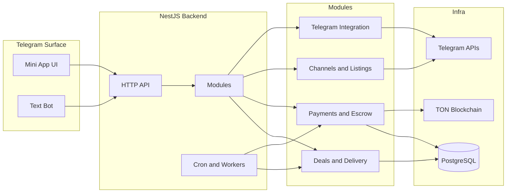

# PostGramX Backend MVP

Open source backend for a Telegram ads marketplace with TON escrow and deal automation.


## Architecture diagram



## What this project demonstrates

- Product first marketplace flow for advertisers and channel owners
- Escrow based TON payments with per deal deposit wallets
- Deal state machine with automation and timeouts
- Verified posting flow with delivery checks
- Clean modular NestJS backend ready for open source

## Core concept

This MVP is centered on one Deal entity that connects listings negotiation creative payment posting and settlement.

## Deal lifecycle

High level stages based on the internal state machine

- CREATIVE_AWAITING_SUBMIT
- CREATIVE_AWAITING_CONFIRM
- CREATIVE_AWAITING_FOR_CHANGES
- SCHEDULING_AWAITING_SUBMIT
- SCHEDULING_AWAITING_CONFIRM
- SCHEDULE_AWAITING_FOR_CHANGES
- PAYMENT_AWAITING
- PAYMENT_PARTIALLY_PAID
- POST_SCHEDULED
- POST_PUBLISHING
- POSTED_VERIFYING
- DELIVERY_CONFIRMED
- REFUNDING
- FINALIZED

See full details in [DEAL_FLOW.md](DEAL_FLOW.md).

## Escrow model on TON

- Each deal has its own deposit address
- Advertiser funds the deposit wallet
- Funds are held until delivery is verified
- Payout or refund is handled by the settlement pipeline

No payout happens without escrow confirmation.

## Verified Telegram stats

- Channel preview and linking are handled in the channels module
- Admin rights are required for verification
- Stats are refreshed on demand and cached per channel

## Tech stack

Backend
- NestJS
- PostgreSQL with TypeORM
- TON SDK and toncenter provider
- Telegram Bot API

Frontend
- Telegram Mini App

## Running locally

```bash
cp .env.example .env
npm install
npm run start:dev
```

## Telegram bot setup

```bash
TELEGRAM_BOT_TOKEN=your_bot_token
TELEGRAM_BOT_USERNAME=Postgramx_bot
TELEGRAM_MINI_APP_URL=https://t.me/postgramx_bot?startapp=marketplace
TELEGRAM_MINIAPP_SHORT_NAME=PostGramX
TELEGRAM_BOT_MODE=polling
TELEGRAM_WEBHOOK_URL=
TELEGRAM_ALLOWED_UPDATES=message,callback_query
```

## AI usage disclosure

About 30 to 40 percent of the codebase was generated with AI assistance with manual review refactoring and final architecture control by the author.

## Documentation

- [ARCHITECTURE.md](ARCHITECTURE.md)
- [DEAL_FLOW.md](DEAL_FLOW.md)
- [SECURITY.md](SECURITY.md)
- [ROADMAP.md](ROADMAP.md)
