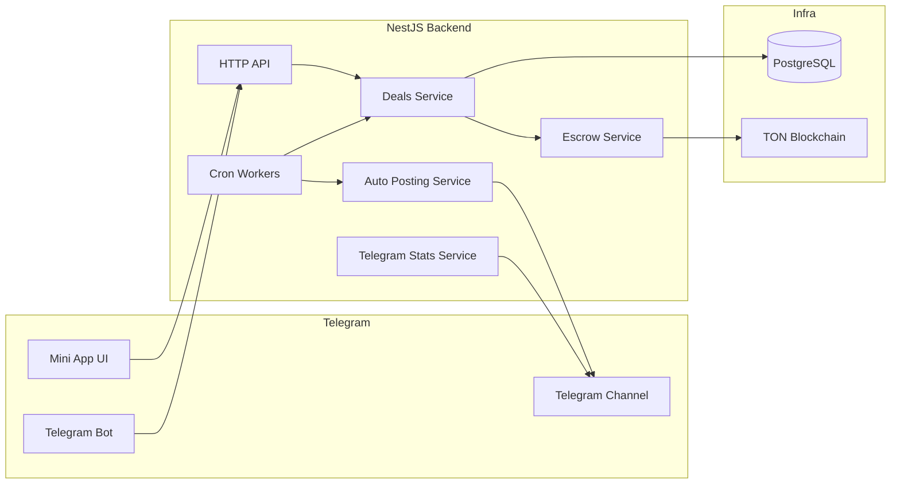

# PostGramX Backend

Backend for a Telegram ads marketplace MVP with escrow on TON. This repository contains proprietary software.


## What this project shows

- Product first two sided marketplace logic
- Escrow first payment model on TON
- Deal lifecycle based on explicit states
- Async posting verification and payout release
- Backend architecture ready for production growth

## Architecture preview



Source file: `docs/diagrams/system-architecture.mmd`

## Core concept

The platform is built around one Deal entity.
A deal links advertiser publisher channel creative escrow and publication.
This keeps business logic in one flow and avoids split state.

Main entities:

- `DealEntity`
- `DealCreativeEntity`
- `DealEscrowEntity`
- `DealPublicationEntity`

## Deal lifecycle

Main stage flow:

`CREATIVE_AWAITING_SUBMIT`
→ `CREATIVE_AWAITING_CONFIRM`
→ `SCHEDULING_AWAITING_SUBMIT`
→ `SCHEDULING_AWAITING_CONFIRM`
→ `PAYMENT_AWAITING`
→ `PAYMENT_PARTIALLY_PAID`
→ `POST_SCHEDULED`
→ `POST_PUBLISHING`
→ `POSTED_VERIFYING`
→ `DELIVERY_CONFIRMED`
→ `FINALIZED`

Cancel and refund path:

`REFUNDING` → `FINALIZED`

See full rules and diagrams in [DEAL_FLOW.md](./DEAL_FLOW.md).

## Escrow model

- Advertiser sends funds to escrow deposit address
- Funds are held before posting is verified
- Payout is released only after delivery confirmation
- Refund path is handled by state aware jobs and payment services

See details in [SECURITY.md](./SECURITY.md).

## Telegram analytics and verification

- Channel and posting data are validated through Telegram services
- Post monitoring runs in background workers
- Publication can be marked as edited deleted failed or verified
- Delivery checks drive settlement and payout eligibility

## i18n support

- Built in localization is enabled via `nestjs-i18n`
- Currently supported languages: English (`en`) and Russian (`ru`)
- Translation resources are stored in `src/i18n/en` and `src/i18n/ru`

## Documentation map

- [ARCHITECTURE.md](./ARCHITECTURE.md)
- [DEAL_FLOW.md](./DEAL_FLOW.md)
- [SECURITY.md](./SECURITY.md)
- [LIQUIDITY_AND_FEES.md](./LIQUIDITY_AND_FEES.md)
- [ROADMAP.md](./ROADMAP.md)
- [docs/diagrams/system-architecture.mmd](./docs/diagrams/system-architecture.mmd)
- [docs/diagrams/deal-lifecycle.mmd](./docs/diagrams/deal-lifecycle.mmd)
- [docs/diagrams/deal-sequence.mmd](./docs/diagrams/deal-sequence.mmd)
- [docs/diagrams/escrow-status-flow.mmd](./docs/diagrams/escrow-status-flow.mmd)
- [docs/diagrams/liquidity-flow.mmd](./docs/diagrams/liquidity-flow.mmd)
- [docs/diagrams/fees-calculation-flow.mmd](./docs/diagrams/fees-calculation-flow.mmd)

## Tech stack

Backend:

- NestJS
- TypeScript
- TypeORM
- PostgreSQL
- TON libraries (`@ton/ton`)
- Telegram bot and MTProto integrations

## Launch

### 1) Install dependencies

```bash
npm install
```

### 2) Select runtime environment (`NODE_ENV`)

The backend loads env files in this order:

1. `.env` (if exists)
2. `.env.<NODE_ENV>` with override enabled

Default env is `local`, so without extra settings it will use `.env.local`.

- `NODE_ENV=local` → `.env.local`
- `NODE_ENV=stage` → `.env.stage`
- `NODE_ENV=production` → `.env.production`

### 3) Fill key env values (what is required and where to get it)

Below are the most important secrets/configs for a real local launch.

#### Database

- `POSTGRES_HOST`, `POSTGRES_PORT`, `POSTGRES_USER`, `POSTGRES_PASSWORD`, `POSTGRES_DB`
- Source: your local PostgreSQL instance (or dev DB provided by your team)

#### Telegram Bot

- `BOT_TOKEN`: create via [@BotFather](https://t.me/BotFather)
- `TELEGRAM_BOT_USERNAME`: bot username without `@`
- `TELEGRAM_SUPPORT_URL`: support chat/user link (optional but recommended)

#### MTProto (for post verification via `mtproto` provider)

- `MTPROTO_API_ID`, `MTPROTO_API_HASH`: create at https://my.telegram.org (`API development tools`)
- `MTPROTO_PHONE`: phone number of Telegram account used for MTProto auth
- `MTPROTO_SESSION`: generated session string (see script below)

If you use MTProto verification, keep:

- `TELEGRAM_POST_VERIFY_PROVIDER=mtproto`
- `MTPROTO_ENABLED=true`

#### TON / escrow / payouts

- `TON_NETWORK` (`testnet` for local/dev)
- `TONCENTER_RPC` and optionally `TONCENTER_API_KEY` (get API key from toncenter)
- `HOT_WALLET_ADDRESS`, `HOT_WALLET_MNEMONIC`: hot wallet used for payouts/sweeps
- `WALLET_MASTER_KEY`: encryption key for wallet-related secrets in DB

### 4) Generate critical secrets locally

#### 4.1 Generate MTProto session

After setting `MTPROTO_API_ID`, `MTPROTO_API_HASH`, `MTPROTO_PHONE` in `.env.local`, run:

```bash
npm run mtproto:generate-session
```

The script will ask for login/2FA and print a `MTPROTO_SESSION` string.
Save this value to `.env.local`.

#### 4.2 Generate / prepare hot wallet

To generate a wallet mnemonic + address for local usage:

```bash
npx ts-node -r tsconfig-paths/register src/scripts/generate-wallet.ts
```

Then copy mnemonic/address to:

- `HOT_WALLET_MNEMONIC`
- `HOT_WALLET_ADDRESS`

If you need to deploy wallet contract (depending on wallet state/network), use:

```bash
npm run deploy:hot-wallet
```

#### 4.3 Generate `WALLET_MASTER_KEY`

Use a secure random base64 key, for example:

```bash
openssl rand -base64 32
```

Put result into `WALLET_MASTER_KEY`.

### 5) Start backend

```bash
# local (recommended for development)
npm run start:local

# stage-like mode
npm run start:stage

# production env in watch mode
npm run start:prod
```

### 6) Build / production run

```bash
npm run build
npm run start:production
```

### 7) Security notes for env files

- Never share real `BOT_TOKEN`, mnemonics, API keys, or `WALLET_MASTER_KEY`.
- Keep production secrets in secret manager / CI vault, not in Git.
- Use separate wallets and API keys for `local`, `stage` and `production`.


## Legal and repository protection

### License and ownership

- Copyright (c) 2026 PatStudio LLC. All rights reserved.
- This codebase is **proprietary / closed-source** (not open-source).
- No one may use, copy, modify, or distribute this code without written permission from PatStudio LLC.

### GitHub visibility and access

- GitHub hosting does **not** automatically make a project open-source.
- Keep the repository **Private** for commercial core logic whenever possible.
- If needed, split architecture into:
  - private core backend
  - public SDK/API clients
  - public docs

### Practical legal hardening checklist

1. Add a proprietary `LICENSE` file (included in this repo).
2. Keep a clear copyright notice in README and release artifacts.
3. Limit collaborator access by least-privilege roles.
4. Use NDA + contractor IP assignment for everyone with source access.
5. Consider formal copyright registration for stronger enforcement.

## AI usage in the project

AI tools were used partially during project development.
Estimated AI contribution is about **20%**.
Mainly this includes:

- partial scripts for i18n;
- template (boilerplate) code.

