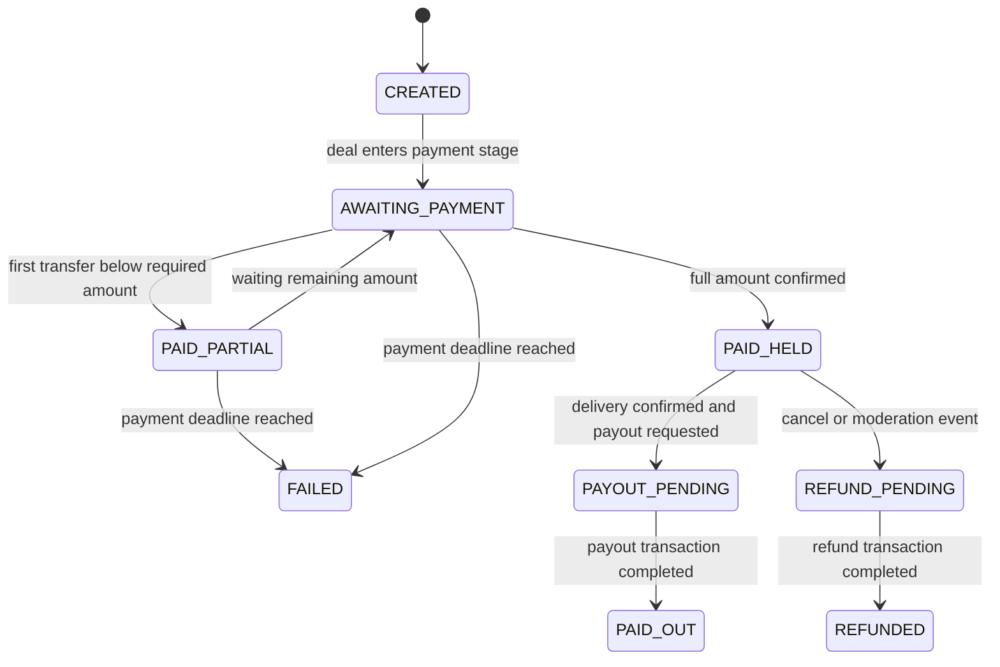

# Security Model

## Escrow safety rules

- Funds are locked in escrow before delivery is accepted
- Payout release is allowed only after verification path is complete
- Refund path is explicit and tied to deal and escrow states
- Payment and payout logic is built for safe retries

## Escrow status diagram

Mermaid source: `docs/diagrams/escrow-status-flow.mmd`

## Escrow statuses and purpose

- `CREATED` reserve escrow row for deal and lock expected amount
- `AWAITING_PAYMENT` wait for on chain payment to deposit address
- `PAID_PARTIAL` store partial amount and keep payment window open
- `PAID_HELD` full amount is confirmed and funds stay locked
- `PAYOUT_PENDING` payout release is requested and tx is in progress
- `PAID_OUT` payout finished and escrow is settled
- `REFUND_PENDING` refund is requested after cancel or failure
- `REFUNDED` refund finished and escrow is settled
- `FAILED` payment window expired or unrecoverable payment path

## Wallet responsibilities

Hot wallet is used for operational transfers only.
Escrow state determines if transfer is allowed.
No payout should happen outside escrow approved path.

## Idempotency and locking

Critical transitions use database backed states and service guards.
Retries should not create duplicate payouts or duplicate refunds.

Recommended controls:

- Lock by deal id during settlement updates
- Check terminal statuses before writing new state
- Keep request records for payout and refund actions

## Replay protection

External callbacks and async tasks must validate current state before action.
If state moved forward callback result should be ignored or logged.

## Telegram delivery checks

Publication verification is asynchronous.
System monitors post state and pin visibility.
Settlement depends on verification result.

## Operational guidance

- Keep private keys outside codebase and use secure secret storage
- Limit access to payout operations
- Log all escrow transitions with actor and reason
- Alert on failed payout and repeated refund attempts
